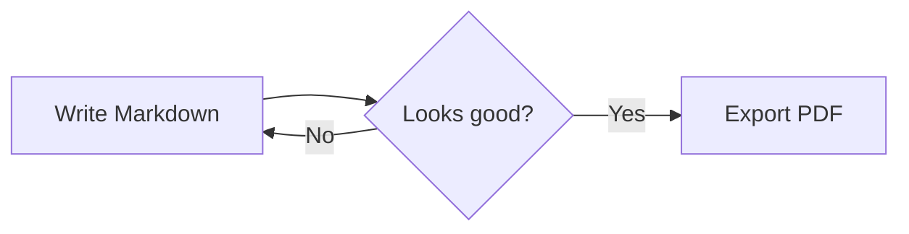
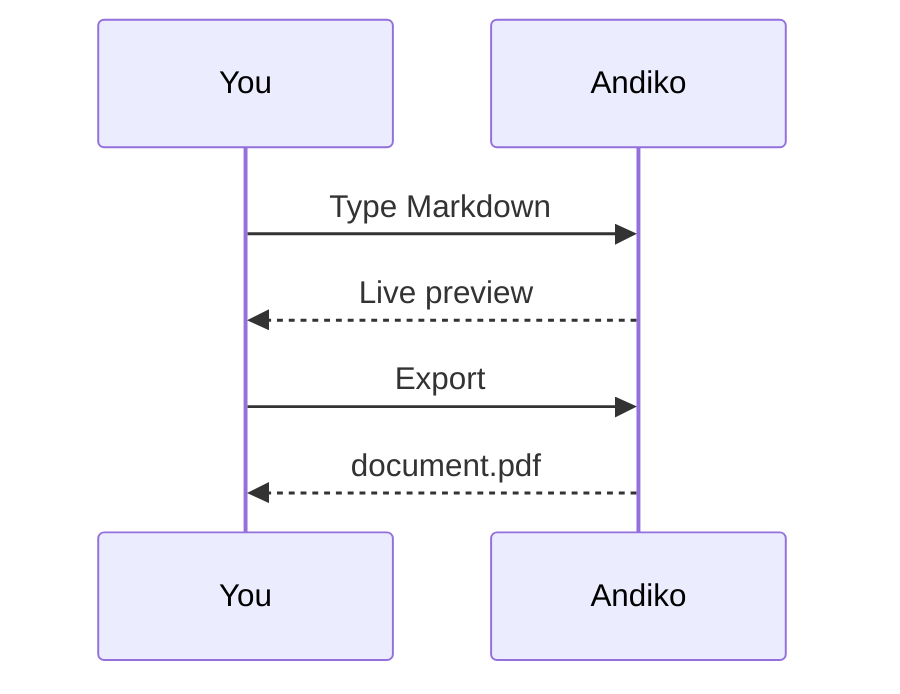

# Welcome to Andiko

Andiko is a Markdown editor with a live preview. Write on the left, read on the right, and switch between **Edit**, **Split** and **View** from the toolbar or with <kbd>Ctrl</kbd> + <kbd>Alt</kbd> + <kbd>E</kbd> / <kbd>B</kbd> / <kbd>V</kbd>.

Everything is saved automatically in this browser. Use **Export → PDF** to download a print-ready copy.

[TOC]

## Text

You can write **bold**, *italic*, ~~strikethrough~~, `inline code`, ==highlighted==, ++inserted++, H~2~O and 19^th^ text. Links like [Markdown Guide](https://www.markdownguide.org) and bare URLs such as https://commonmark.org become clickable. Emoji shortcodes work too :tada: :rocket:

Single line breaks
are kept, unless the front matter sets `breaks: false`.

*[HTML]: Hyper Text Markup Language
Abbreviations show a tooltip: HTML.

> Blockquotes are great for callouts and citations.
> > They can be nested.

## Alert boxes

:::info
:bulb: **Info** — use `:::info` for tips and notes.
:::

:::success
**Success** — something went right.
:::

:::warning
**Warning** — be careful here.
:::

:::danger
**Danger** — this action cannot be undone.
:::

:::spoiler Click to reveal a spoiler
Hidden content lives inside `:::spoiler`. Add `{state="open"}` to start expanded.
:::

## Lists

- Unordered item
  - Nested item
    - Deeper still
- Another item

1. First
2. Second
3. Third

### Task list

Click a checkbox in the preview to update the source.

- [x] Write some Markdown
- [x] Preview it side by side
- [ ] Export it as a PDF

### Definitions

Markdown
: A lightweight markup language.

Andiko
: A local-first Markdown editor that runs in your browser.

## Code

Add `=` after the language for line numbers, `=101` to start at a given line, `=+` to continue from the previous block and `!` to wrap long lines.

```javascript=
function greet(name) {
  // say hello
  return `Hello, ${name}!`
}
```

```javascript=+
console.log(greet("Andiko"))
```

```python=101
def fibonacci(n: int) -> int:
    """Return the n-th Fibonacci number."""
    return n if n < 2 else fibonacci(n - 1) + fibonacci(n - 2)
```

```bash!
echo "This is a very long command line that wraps instead of scrolling horizontally because the fence ends with an exclamation mark"
```

## Tables

| Feature        | Syntax              | Supported |
| -------------- | :------------------ | :-------: |
| Alert boxes    | `:::info`           |    ✅     |
| Math           | `$...$`, `$$...$$`  |    ✅     |
| Diagrams       | ` ```mermaid `      |    ✅     |
| Line numbers   | ` ```js= `          |    ✅     |

## Math

Inline math like $E = mc^2$ and $\sum_{i=1}^{n} i = \frac{n(n+1)}{2}$ sits in the text. Display math gets its own block:

$$
\int_{-\infty}^{\infty} e^{-x^2}\,dx = \sqrt{\pi}
$$

## Diagrams





## Footnotes

Andiko renders footnotes[^1] and collects them at the end of the document[^note].

[^1]: Like this one.
[^note]: Footnotes can hold **formatting** too.

---

Happy writing! :writing_hand:
